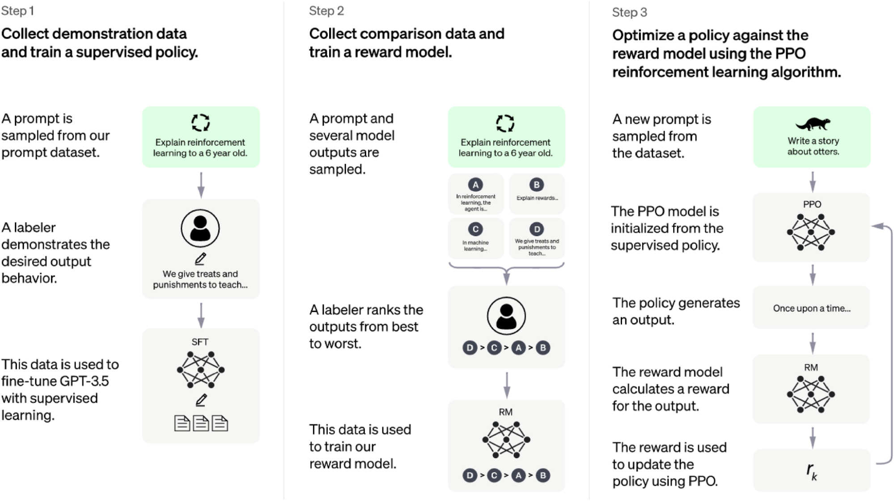

# LLaMa 3

This file will be updated once the LLaMa 3 technical report is released.

<!-- toc -->

- [Summary](#summary)
- [Model Performance](#model-performance)
  * [Base Model](#base-model)
  * [Instruct Model](#instruct-model)
  * [400B model](#400b-model)
- [LLaMa 3 Infrastructure](#llama-3-infrastructure)
  * [Tiktokenizer](#tiktokenizer)
  * [KV Cache](#kv-cache)
  * [RoPE (Rotary Positional Embedding)](#rope-rotary-positional-embedding)
- [LLaMa 3 Training Details](#llama-3-training-details)

<!-- tocstop -->

## Summary

Llama 3 models take data and scale to new heights. It’s been trained on our two recently announced custom-built 24K GPU clusters on over 15T tokens of data – a training dataset 7x larger than that used for Llama 2, including 4x more code. This results in the most capable Llama model yet, which supports an 8K context length that doubles the capacity of Llama 2. The training details have not been disclosed yet, but they should not differ significantly from llama2

* Publish 8B and 70B. 400B+ ongoing
* 15T token
* 8x window size
* More alignment
* Tiktoken, grouped query attention (GQA)
* Finetune: SFT, Rejection Sampling, PPO, DPO (new compared to llama2)

<table>
  <tr>
   <td>
   </td>
   <td>
LLaMa 2
   </td>
   <td>LLaMa 3
   </td>
  </tr>
  <tr>
   <td>Pretrain token size
   </td>
   <td>2T
   </td>
   <td>15T
   </td>
  </tr>
  <tr>
   <td>Context length
   </td>
   <td>4k
   </td>
   <td>8k
   </td>
  </tr>
  <tr>
   <td>SFT data
   </td>
   <td>1M
   </td>
   <td>10M
   </td>
  </tr>
  <tr>
   <td>Finetune
   </td>
   <td>SFT, Rejection Sampling, PPO
   </td>
   <td>SFT, Rejection Sampling, PPO, DPO
   </td>
  </tr>
  <tr>
   <td>Mode size
   </td>
   <td>7B, 13B, 70B
   </td>
   <td>8B, 70B, 400B
   </td>
  </tr>
</table>

Readings:

[https://ollama.com/blog/llama-3-is-not-very-censored](https://ollama.com/blog/llama-3-is-not-very-censored)

## Model Performance

### Base Model

### Instruct Model

### 400B model

Comparable accuracy with GPT4?

## LLaMa 3 Infrastructure

Decoder-only transformer

### Tiktokenizer

[https://github.com/openai/tiktoken](https://github.com/openai/tiktoken)

Code: [https://github.com/meta-llama/llama3/blob/main/llama/tokenizer.py](https://github.com/meta-llama/llama3/blob/main/llama/tokenizer.py)

Useful tools: [https://tiktokenizer.vercel.app/](https://tiktokenizer.vercel.app/)

BPE algorithm

[Paper: Neural Machine Translation of Rare Words with Subword Units](https://aclanthology.org/P16-1162.pdf)

The Byte Pair Encoding (BPE) algorithm is a technique used in tokenization, particularly in natural language processing tasks like text generation and machine translation. In the context of tokenization with tools like the Hugging Face tokenizers library in Python, the BPE algorithm is used to segment words into **subword units**.

* Initialization: Initially, each character in the vocabulary is treated as a token.
* Iterative Merging: The algorithm iteratively merges the most frequent pair of consecutive tokens (characters or subwords) into a single new token. This process continues for a specified number of iterations or until a predefined vocabulary size is reached.
* Vocabulary Construction: After a certain number of iterations or when a predefined vocabulary size is reached, the final vocabulary is constructed. Each token in the vocabulary represents either a single character or a combination of characters (subword unit) that frequently occur together in the corpus.
* Encoding: During encoding, words in the input text are segmented into subword units based on the constructed vocabulary. Rare or unseen words can be decomposed into smaller subword units that are present in the vocabulary, thus enabling the model to handle unseen words more effectively.

Readings: [https://web.stanford.edu/~jurafsky/slp3/2.pdf](https://web.stanford.edu/~jurafsky/slp3/2.pdf)

### KV Cache

[Paper: EFFICIENTLY SCALING TRANSFORMER INFERENCE](https://arxiv.org/pdf/2211.05102)

The KV cache strategy involves storing the key (K) and value (V) matrices for each input sequence during the first forward pass through the model. These matrices are then reused in subsequent forward passes for input sequences that have identical content, saving computation time by avoiding redundant calculations.

By caching the key and value matrices (KV), the model can skip the expensive computation of these matrices for input sequences that have been previously encountered, thus improving overall inference speed and efficiency, especially in scenarios where the same input sequences are processed multiple times.

Space need = 2 * 2 * head_dim * n_heads * n_layers * max_context_length * batch_size

E.g. GPT 3 needs 4.5G

Readings:

[https://www.omrimallis.com/posts/techniques-for-kv-cache-optimization/#:~:text=The%20remarkable%20capabilities%20of%20Large,LLM%20performance%20and%20context%20size](https://www.omrimallis.com/posts/techniques-for-kv-cache-optimization/#:~:text=The%20remarkable%20capabilities%20of%20Large,LLM%20performance%20and%20context%20size).

grouped-query attention [Paper: GQA: Training Generalized Multi-Query Transformer Models from Multi-Head Checkpoints](https://arxiv.org/pdf/2305.13245v3)

[https://github.com/vllm-project/vllm](https://github.com/vllm-project/vllm)

### RoPE (Rotary Positional Embedding)

[Paper: RoFormer: Enhanced Transformer with Rotary Position Embedding](https://arxiv.org/pdf/2104.09864)

The paper proposes a novel method called Rotary Position Embedding (RoPE) for incorporating positional information into transformer-based language models in an effective way. RoPE encodes the absolute position with a rotation matrix and incorporates explicit relative position dependency in the self-attention formulation.

## LLaMa 3 Training Details

* Pre-train
    * General data
    * Base model
* Finetune
    * Instruct model or chat model
    * SFT
        * very similar to pre train process
        * Trick: LoRA
    * Alignment
        * Reward Model and PPO
            * Reinforcement learning
            * Use pretrained model (after SFT) as reward model (input, output) -> score
        * Rejection Sampling
        * DPO
            * Not reinforcement learning

SFT data example: [https://huggingface.co/datasets/tatsu-lab/alpaca](https://huggingface.co/datasets/tatsu-lab/alpaca)

PPO data example: [https://huggingface.co/datasets/argilla/Capybara-Preferences](https://huggingface.co/datasets/argilla/Capybara-Preferences)

Readings:

[https://ai.meta.com/blog/meta-llama-3/](https://ai.meta.com/blog/meta-llama-3/)

[https://huggingface.co/learn/deep-rl-course/unit8/introduction](https://huggingface.co/learn/deep-rl-course/unit8/introduction)