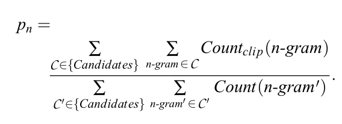

# Evaluation

<!-- toc -->

- [Traditional NLP Metrics](#traditional-nlp-metrics)
  * [BLEU](#bleu)
  * [ROUGE](#rouge)
  * [Perplexity](#perplexity)
- [LLM Evaluation](#llm-evaluation)
  * [Benchmarks](#benchmarks)
  * [LLM Benchmarks](#llm-benchmarks)
  * [Beyond accuracy](#beyond-accuracy)
  * [Tools](#tools)

<!-- tocstop -->

## Traditional NLP Metrics

The direct use of metrics such as perplexity and BLEU score has declined in popularity, largely due to their inherent flaws in many contexts. However, it remains crucial to comprehend these metrics and discern their appropriate applications.

### BLEU

[Paper: BLEU: a Method for Automatic Evaluation of Machine Translation](https://aclanthology.org/P02-1040.pdf)

Originally developed to measure machine translation. BLEU scores are based on an average of unigram, bigram, trigram and 4-gram precision

**Example1:**

candidate: the cat sat on the mat

reference: the cat is on the mat

bleu1 score = ⅚ = 0.83

bleu2 score = ⅗ = 0.6

Checking for the occurrence of five words from the candidate set, {the cat, cat sat, sat on, on the, the mat}, within the reference set, it was found that three of these words are present in the reference set. Hence, the proportion is 0.6.

**Example2:**

candidate: the the the the the

reference: the cat is on the mat

bleu1 score = ⅖ = 0.4

We clipped the occurrence of “the” in the reference

Readings:

[https://towardsdatascience.com/evaluating-text-output-in-nlp-bleu-at-your-own-risk-e8609665a213](https://towardsdatascience.com/evaluating-text-output-in-nlp-bleu-at-your-own-risk-e8609665a213)

### ROUGE

BLEU focuses on precision: how much the words (and/or n-grams) in the candidate model outputs appear in the human reference.

ROUGE focuses on recall: how much the words (and/or n-grams) in the human references appear in the candidate model outputs.

### Perplexity

Perplexity (PPL) is one of the most common metrics for evaluating language models. Intuitively, perplexity can be understood as a measure of uncertainty. The perplexity of a language model can be seen as the level of perplexity when predicting the following symbol.

Most language models estimate this probability as a product of each symbol's probability given its preceding symbols.

Perplexity is defined as the exponentiated average negative log-likelihood of a sequence. If we have a tokenized sequence 𝑋=(𝑥0,𝑥1,…,𝑥𝑡), then the perplexity of 𝑋 is,

Where log𝑝𝜃(𝑥𝑖∣𝑥&lt;𝑖) is the log-likelihood of the ith token conditioned on the preceding tokens 𝑥&lt;𝑖 according to our model. This is also equivalent to the exponentiation of the cross-entropy between the data and model predictions. So log(perplexity) = cross-entropy which is the training loss of the causal language model

Readings:

[https://huggingface.co/docs/transformers/perplexity](https://huggingface.co/docs/transformers/perplexity)

[https://thegradient.pub/understanding-evaluation-metrics-for-language-models/](https://thegradient.pub/understanding-evaluation-metrics-for-language-models/)

## LLM Evaluation

### Benchmarks

Traditionally we have benchmarks for different tasks in NLP.

<table>
  <tr>
   <td><strong>NLP Tasks</strong>
   </td>
   <td><strong>Description</strong>
   </td>
   <td><strong>Benchmark Dataset</strong>
   </td>
   <td><strong>Metrics</strong>
   </td>
  </tr>
  <tr>
   <td>Sentiment Analysis
   </td>
   <td>Determine sentiment (positive/negative/neutral) of text
   </td>
   <td>IMDb Reviews
   </td>
   <td>Accuracy, F1-score, ROC AUC
   </td>
  </tr>
  <tr>
   <td>Named Entity Recognition (NER)
   </td>
   <td>Identify and classify named entities in text
   </td>
   <td>CoNLL-2003
   </td>
   <td>Precision, Recall, F1-score
   </td>
  </tr>
  <tr>
   <td>Part-of-Speech Tagging (POS)
   </td>
   <td>Assign grammatical categories to words in a sentence
   </td>
   <td>Penn Treebank
   </td>
   <td>Accuracy, F1-score
   </td>
  </tr>
  <tr>
   <td>Machine Translation
   </td>
   <td>Translate text from one language to another
   </td>
   <td>WMT (Workshop on Machine Translation)
   </td>
   <td>BLEU score, METEOR, TER
   </td>
  </tr>
  <tr>
   <td>Text Classification
   </td>
   <td>Categorize text documents into predefined classes
   </td>
   <td>GLUE (General Language Understanding Evaluation)
   </td>
   <td>Accuracy, F1-score, Precision, Recall
   </td>
  </tr>
  <tr>
   <td>Question Answering (QA)
   </td>
   <td>Generate answers to questions posed in natural language
   </td>
   <td>SQuAD (Stanford Question Answering Dataset)
   </td>
   <td>Exact Match (EM), F1-score
   </td>
  </tr>
  <tr>
   <td>Text Summarization
   </td>
   <td>Generate concise summaries of longer text documents
   </td>
   <td>CNN/Daily Mail
   </td>
   <td>ROUGE score, BLEU score
   </td>
  </tr>
  <tr>
   <td>Language Modeling
   </td>
   <td>Predict the next word in a sequence of text
   </td>
   <td>-
   </td>
   <td>Perplexity
   </td>
  </tr>
</table>

For example, the GLUE benchmark is a collection of 9 different NLP tasks

### LLM Benchmarks

Evaluate LLM should not focus on a single task in traditional NLP. Compare human-level performance on various professional and academic benchmarks from GPT-4 report.

More benchmarks

Tools: Based on the [Language Model Evaluation Harness](https://github.com/EleutherAI/lm-evaluation-harness), the [Open LLM Leaderboard](https://huggingface.co/spaces/HuggingFaceH4/open_llm_leaderboard) is the main benchmark for general-purpose LLMs (like ChatGPT). There are other popular benchmarks like [BigBench](https://github.com/google/BIG-bench), [MT-Bench](https://arxiv.org/abs/2306.05685), etc.

### Beyond accuracy

Expanding upon the principles of the 3H rule (Helpfulness, Honesty, and Harmlessness)

Still need human evaluation

This evaluation set contains 1,800 prompts that cover 12 key use cases

### Tools

<table>
  <tr>
   <td><strong>Frameworks / Platforms</strong>
   </td>
   <td><strong>Description</strong>
   </td>
   <td><strong>Tutorials/lessons</strong>
   </td>
   <td><strong>Reference</strong>
   </td>
  </tr>
  <tr>
   <td><strong>Azure AI Studio Evaluation (Microsoft)</strong>
   </td>
   <td>Azure AI Studio is an all-in-one AI platform for building, evaluating, and deploying generative AI solutions and custom copilots.Technical Landscape: No code: model catalog in AzureML studio & AI studio, Low-code: as CLI, Pro-code: as azureml-metrics SDK
   </td>
   <td><a href="https://learn.microsoft.com/en-us/azure/ai-studio/concepts/evaluation-approach-gen-ai">Tutorials</a>
   </td>
   <td><a href="https://ai.azure.com/">Link</a>
   </td>
  </tr>
  <tr>
   <td><strong>Prompt Flow (Microsoft)</strong>
   </td>
   <td>A suite of development tools designed to streamline the end-to-end development cycle of LLM-based AI applications, from ideation, prototyping, testing, and evaluation to production, deployment, and monitoring.
   </td>
   <td><a href="https://microsoft.github.io/promptflow/how-to-guides/quick-start.html">Tutorials</a>
   </td>
   <td><a href="https://github.com/microsoft/promptflow">Link</a>
   </td>
  </tr>
  <tr>
   <td><strong>Weights & Biases(Weights & Biases)</strong>
   </td>
   <td>A Machine Learning platform to quickly track experiments, version and iterate on datasets, evaluate model performance, reproduce models, visualize results and spot regressions, and share findings with colleagues.
   </td>
   <td><a href="https://docs.wandb.ai/tutorials">Tutorias</a>, <a href="https://learn.deeplearning.ai/evaluating-debugging-generative-ai">DeepLearning.AI Lesson</a>
   </td>
   <td><a href="https://docs.wandb.ai/">Link</a>
   </td>
  </tr>
  <tr>
   <td><strong>LangSmith (LangChain)</strong>
   </td>
   <td>Helps the user trace and evaluate language model applications and intelligent agents to help user move from prototype to production.
   </td>
   <td><a href="https://docs.smith.langchain.com/evaluation">Tutorials</a>
   </td>
   <td><a href="https://www.langchain.com/langsmith">Link</a>
   </td>
  </tr>
  <tr>
   <td><strong>TruLens (TruEra)</strong>
   </td>
   <td>TruLens provides a set of tools for developing and monitoring neural nets, including LLMs. This includes both tools for the evaluation of LLMs and LLM-based applications with TruLens-Eval and deep learning explainability with TruLens-Explain.
   </td>
   <td><a href="https://www.trulens.org/trulens_explain/quickstart/">Tutorials</a>, <a href="https://learn.deeplearning.ai/building-evaluating-advanced-rag">DeepLearning.AI Lesson</a>
   </td>
   <td><a href="https://github.com/truera/trulens">Link</a>
   </td>
  </tr>
  <tr>
   <td><strong>Vertex AI Studio (Google)</strong>
   </td>
   <td>You can evaluate the performance of foundation models and your tuned generative AI models on Vertex AI. The models are evaluated using a set of metrics against an evaluation dataset that you provide.
   </td>
   <td><a href="https://cloud.google.com/vertex-ai/docs/generative-ai/models/evaluate-models">Tutorials</a>
   </td>
   <td><a href="https://cloud.google.com/vertex-ai?hl=en">Link</a>
   </td>
  </tr>
  <tr>
   <td><strong>Amazon Bedrock</strong>
   </td>
   <td>Amazon Bedrock supports model evaluation jobs. The results of a model evaluation job allow you to evaluate and compare a model's outputs, and then choose the model best suited for your downstream generative AI applications. Model evaluation jobs support common use cases for large language models (LLMs) such as text generation, text classification, question and answering, and text summarization.
   </td>
   <td><a href="https://docs.aws.amazon.com/bedrock/latest/userguide/model-evaluation.html">Tutorials</a>
   </td>
   <td><a href="https://docs.aws.amazon.com/bedrock/latest/userguide/what-is-bedrock.html">Link</a>
   </td>
  </tr>
  <tr>
   <td><strong>DeepEval (Confident AI)</strong>
   </td>
   <td>An open-source LLM evaluation framework for LLM applications.
   </td>
   <td><a href="https://github.com/confident-ai/deepeval/tree/main/examples">Examples</a>
   </td>
   <td><a href="https://github.com/confident-ai/deepeval">Link</a>
   </td>
  </tr>
  <tr>
   <td><strong>Parea AI</strong>
   </td>
   <td>Parea helps AI Engineers build reliable, production-ready LLM applications. Parea provides tools for debugging, testing, evaluating, and monitoring LLM-powered applications.
   </td>
   <td><a href="https://docs.parea.ai/blog/eval-metrics-for-llm-apps-in-prod">Article on evals</a>
   </td>
   <td><a href="https://docs.parea.ai/evaluation/overview">Link</a>
   </td>
  </tr>
</table>

Readings:

[https://slds-lmu.github.io/seminar_nlp_ss20/resources-and-benchmarks-for-nlp.html](https://slds-lmu.github.io/seminar_nlp_ss20/resources-and-benchmarks-for-nlp.html)

[https://openai.com/research/gpt-4](https://openai.com/research/gpt-4)

[A Survey on Evaluation of Large Language Models](https://arxiv.org/pdf/2307.03109)

[https://ai.meta.com/blog/meta-llama-3/](https://ai.meta.com/blog/meta-llama-3/)

[https://huggingface.co/spaces/lmsys/chatbot-arena-leaderboard](https://huggingface.co/spaces/lmsys/chatbot-arena-leaderboard)

[https://medium.com/data-science-at-microsoft/evaluating-llm-systems-metrics-challenges-and-best-practices-664ac25be7e5](https://medium.com/data-science-at-microsoft/evaluating-llm-systems-metrics-challenges-and-best-practices-664ac25be7e5)

[https://huggingface.co/blog/open-llm-leaderboard-mmlu](https://huggingface.co/blog/open-llm-leaderboard-mmlu)