# Overview of Quantization

<!-- toc -->

- [Motivation](#motivation)
- [Data Types](#data-types)
- [Quantization Basics](#quantization-basics)
  * [Quantization Target](#quantization-target)
  * [Post-Training Quantization (PTQ)](#post-training-quantization-ptq)
  * [Quantization-Aware Training (QAT)](#quantization-aware-training-qat)
- [Quantization Introduction](#quantization-introduction)
  * [K-means-based Weight Quantization](#k-means-based-weight-quantization)
  * [Linear Quantization](#linear-quantization)
  * [Binary and Ternary Quantization](#binary-and-ternary-quantization)
  * [Automatic Mixed-precision Quantization](#automatic-mixed-precision-quantization)
- [Quantization for LLMs](#quantization-for-llms)
  * [LLM.int8()](#llmint8)
  * [GPTQ](#gptq)
  * [SmoothQuant (W8A8)](#smoothquant-w8a8)
  * [AWQ](#awq)
  * [The Era of 1-bit LLMs: All Large Language Models are in 1.58 Bits](#the-era-of-1-bit-llms-all-large-language-models-are-in-158-bits)
  * [GGUF](#gguf)
- [Toolkit and Code Examples](#toolkit-and-code-examples)
- [Reference](#reference)

<!-- tocstop -->

## Motivation

Why Do We Need Quantization? Today’s AI is too big. While a larger model offers more capabilities, it also demands more expensive hardware and greater hardware resources. Solutions: Model Distillation, Quantization, etc for efficient inference

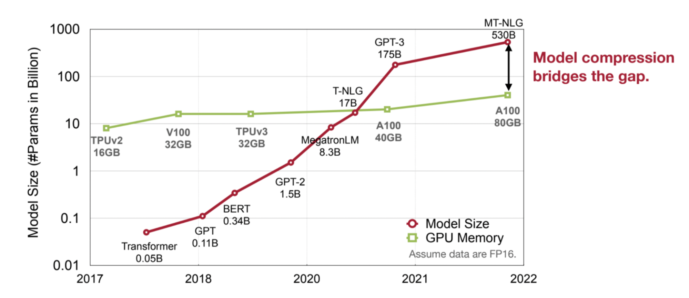

What is quantization?

* Quantization = mapping continuous infinite values to a smaller set of discrete finite values
* In the context of LLMs, it refers to the process of converting the weights of the model from higher-precision data types to lower-precision ones.

## Data Types

How is numeric data represented?

* Integer
    * Unsigned integer
    * Signed integer
* Fixed-point number
* Floating-point number

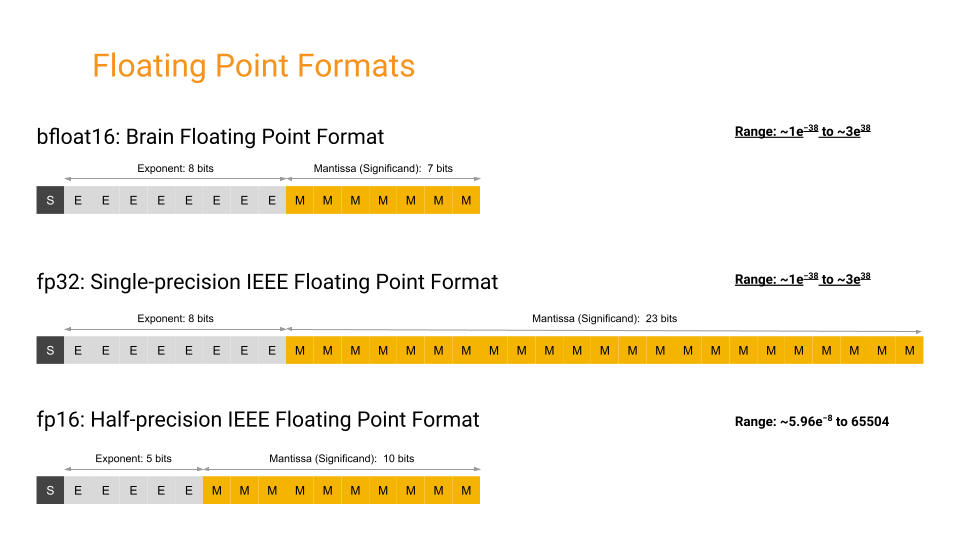

In the context of quantization, floating-point numbers and integers represent different ways to encode numerical values with varying precision. Here's an explanation with examples:

* Floating-Point Numbers:
    * Floating-point numbers are numbers that have both an integer part and a fractional part, separated by a decimal point. They are represented in computer systems using a sign bit, an exponent, and a fraction.
    * Example: 3.14, -0.001, 123.456
    * In binary floating-point representation (common in computer systems), the number 3.14 might be represented as:
        * Sign bit: 0 (positive)
        * Exponent: 10000000 (binary for 128, representing an exponent of 4)
        * Fraction: 1001001000011110101110000101000111101011100001010001111010111000 (binary representation of the fractional part)
* Integers:
    * Integers are whole numbers without any fractional part. They can be positive, negative, or zero.
    * Example: -5, 0, 42
    * In binary integer representation, each digit in the binary number represents a power of 2. For example, the decimal number 42 might be represented as 101010 in binary.
    * Integers require less memory and computational resources compared to floating-point numbers because they do not store fractional parts. They are often used in applications where precise fractional values are not required.

In quantization, floating-point numbers are typically converted to fixed-point representations, which can include integers of various precisions (e.g., 8-bit, 16-bit) to reduce memory usage and computational complexity. For example, instead of storing weights and activations as floating-point numbers, they might be quantized to 8-bit integers, which requires less memory and can be processed more efficiently on hardware platforms with limited resources.

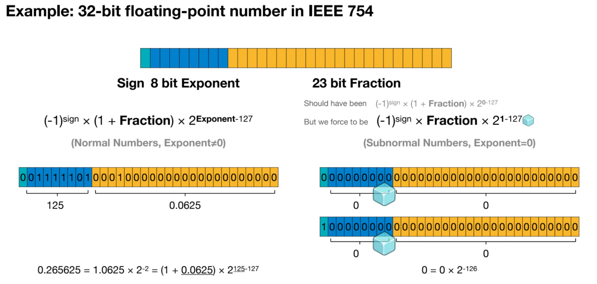

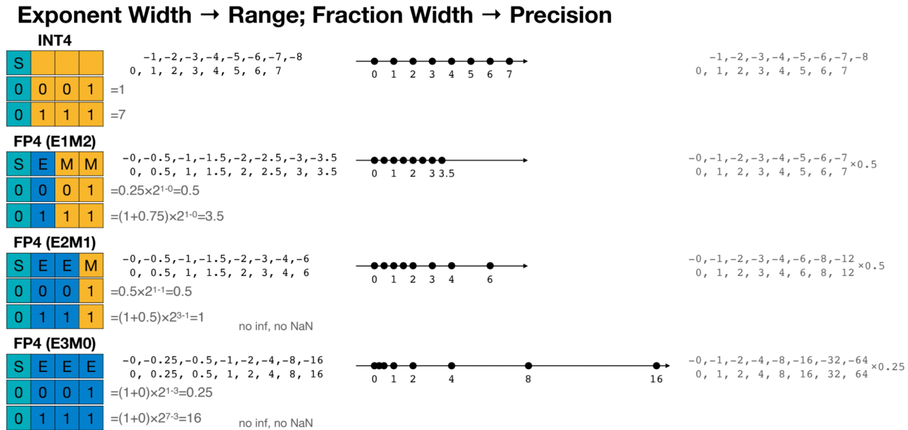

## Quantization Basics

### Quantization Target

When discussing quantization, there are typically several targets for quantization: model weights, activation functions, key-value (KV) caches, and gradients.

* Weight
* Activation
* KV cache
* Gradients

Model quantization techniques are pivotal in compressing neural network models to make them more memory and computationally efficient, particularly for deployment on resource-constrained devices. One common approach is to quantize model weights, which involves representing the weights with reduced precision compared to floating-point numbers. This typically entails converting weights from 32-bit floating-point to 8-bit integers or even lower bit-width representations. While this reduction in precision may result in a slight loss of model accuracy, it significantly reduces the memory footprint and speeds up computations.

In addition to quantizing model weights, another key aspect is quantizing input activations. This involves converting the input data passed through the neural network into lower precision formats before performing computations. By quantizing input activations, the computational cost can be further reduced, as operations on lower precision data require fewer computational resources. However, careful calibration and scaling are necessary to minimize the impact on model accuracy.

Key-value (KV) cache quantization is another technique employed to optimize memory usage during inference. KV caches store intermediate results of computations, which are reused multiple times within the inference process. By quantizing these cached values, memory usage can be significantly reduced without compromising inference accuracy. However, quantizing KV caches requires careful consideration of the trade-off between memory savings and the potential impact on model performance.

Furthermore, quantizing gradients during training can accelerate the optimization process, particularly in scenarios where the computational resources are limited. By quantizing gradients, the memory requirements during backpropagation can be reduced, allowing for larger batch sizes or deeper networks to be trained within the available resources. However, quantizing gradients introduces additional challenges such as gradient clipping and loss of gradient information, which must be addressed to ensure convergence and stability during training. Overall, model quantization techniques play a crucial role in enabling the deployment of deep learning models on a wide range of devices with varying computational constraints.

### Post-Training Quantization (PTQ)

Quantizes a floating-point neural network model, including: channel quantization, group quantization, and range clipping.

Post-Training Quantization (PTQ): PTQ applies quantization after the model has been trained using full precision (typically floating-point arithmetic).

In PTQ, the weights and activations of the trained model are quantized to lower precision representations (such as 8-bit integers) without retraining the model from scratch. This quantization process helps reduce the memory footprint and computational complexity of the model, making it more suitable for deployment on resource-constrained devices like mobile phones or embedded systems.

PTQ typically involves techniques like weight clustering, where weights are grouped into clusters and represented by a single shared value, and activation quantization, where input data are quantized before passing through activation functions. PTQ is relatively straightforward to implement and can yield significant reductions in model size and inference latency with minimal impact on accuracy, especially when combined with techniques like fine-tuning or calibration to mitigate any performance degradation caused by quantization.

* Post-training dynamic quantization (PTDQ) directly transforms each layer by quantizing it using a quantization formula without the need for a calibration dataset.
* Post-training calibration quantization (PTCQ) requires a representative dataset as input and adjusts the quantization weights based on the input and output of each layer in the model. GPTQ utilizes this method.

### Quantization-Aware Training (QAT)

Emulates inference-time quantization during the training/fine-tuning and recover the accuracy.

Quantization-Aware Training (QAT): Unlike PTQ, QAT integrates the weight conversion process during the training stage. This technique involves training a neural network while considering the effects of quantization during both forward and backward passes. By incorporating quantization into the training process, the model learns to adapt to the reduced precision of weights and activations. This can lead to better performance when the quantized model is deployed for inference, as it has been trained to accommodate the quantization-induced errors. This often results in superior model performance, but it's more computationally demanding. 

Quantization during finetuning sometimes known as Quantization-Aware Fine-tuning (QAF). After training a neural network using QAT or a similar technique, the quantized model may still require fine-tuning to further optimize its performance. QAF involves fine-tuning the quantized model using a smaller learning rate to refine its parameters and improve its accuracy or other performance metrics. This fine-tuning process specifically targets the nuances introduced by quantization, helping to mitigate any degradation in performance caused by the quantization process. QLoRA employs this approach.

## Quantization Introduction

### K-means-based Weight Quantization

[Paper: Deep Compression: Compressing Deep Neural Networks with Pruning, Trained Quantization and Huffman Coding](https://arxiv.org/pdf/1510.00149.pdf)

[Han, S., Mao, H., & Dally, W. J. (2015). Deep Compression: Compressing Deep Neural Networks with Pruning, Trained Quantization and Huffman Coding. _ArXiv_. /abs/1510.00149]

K-means-based weight quantization is a technique used in machine learning and particularly in deep learning to reduce the precision of model weights, thereby reducing memory requirements and potentially speeding up computations.

Here's a step-by-step explanation of how it works:

* Initialization: Initially, the weights of the neural network are typically represented as high-precision floating-point numbers, often 32-bit or 64-bit. These high precision weights require significant memory and computational resources.
* K-means Clustering: The first step in K-means-based weight quantization is to apply the K-means clustering algorithm to the weights. In this step, the weights are treated as vectors in a high-dimensional space, and the K-means algorithm is used to partition these vectors into K clusters.
* Centroid Calculation: Once the clusters are formed, the centroid of each cluster is computed. These centroids represent the quantized values that will replace the original weights.
* Quantization: After calculating the centroids, each weight in the neural network is replaced with the centroid value of the cluster to which it belongs. In other words, each weight is quantized to one of the K centroids.
* Encoding: To efficiently store the quantized weights, additional steps may be taken to encode them using a smaller number of bits. For example, instead of using 32 bits to represent each weight, they might be encoded using only 8 bits.
* Decoding: During inference, the quantized weights are decoded back to their original representation using the centroids assigned during quantization.

Benefits of K-means-based weight quantization include:

* Memory Reduction: By quantizing weights to a smaller number of centroids, the memory required to store the weights is significantly reduced.
* Speedup in Inference: The reduced memory footprint can lead to faster inference times due to reduced memory bandwidth requirements and potentially more efficient cache usage.
* Minimal Loss in Accuracy: With careful selection of the number of centroids and optimization of the quantization process, it's possible to minimize the loss in model accuracy even after quantizing the weights.

However, it's important to note that quantizing weights can sometimes lead to a loss of model accuracy, especially if not done carefully. The choice of the number of centroids (K) and the quantization method are critical factors in minimizing this loss. Additionally, the computational cost of applying K-means clustering and the overhead of encoding and decoding weights should be considered when deciding whether to use this technique.

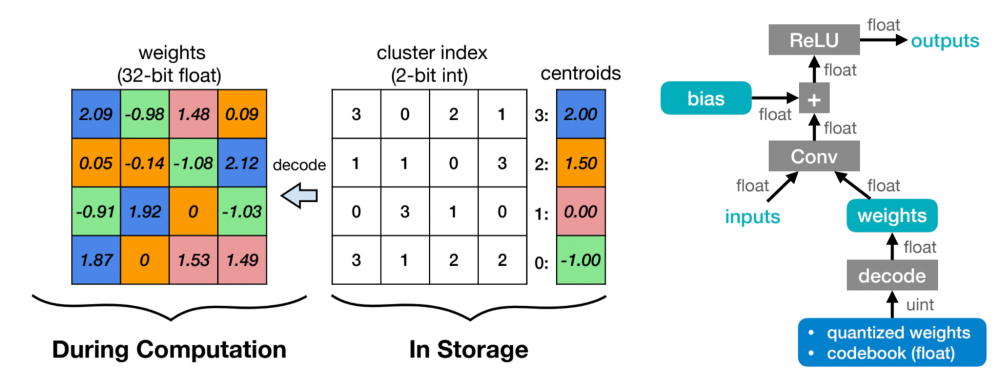

The weights are decompressed using a lookup table (i.e., codebook) during runtime inference.

* K-Means-based Weight Quantization only saves storage cost of a neural network model.
* All the computation and memory access are still floating-point.

### Linear Quantization

[Paper: Quantization and Training of Neural Networks for Efficient Integer-Arithmetic-Only Inference](https://arxiv.org/pdf/1712.05877.pdf)

[Jacob, B., Kligys, S., Chen, B., Zhu, M., Tang, M., Howard, A., Adam, H., & Kalenichenko, D. (2017). Quantization and Training of Neural Networks for Efficient Integer-Arithmetic-Only Inference. _ArXiv_. /abs/1712.05877]

An affine mapping of integers to real numbers.

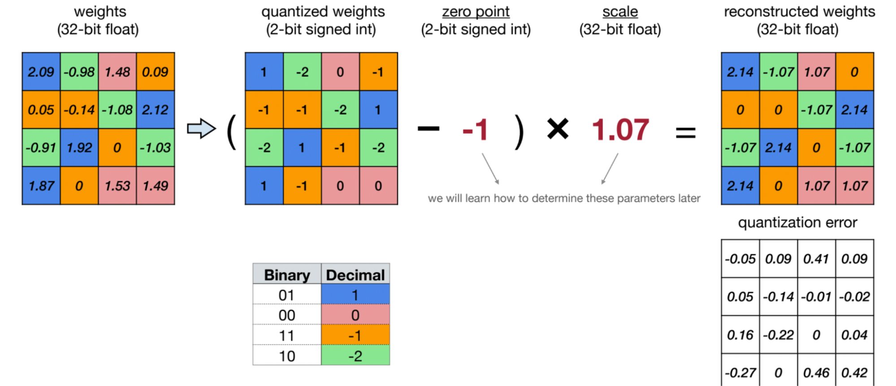

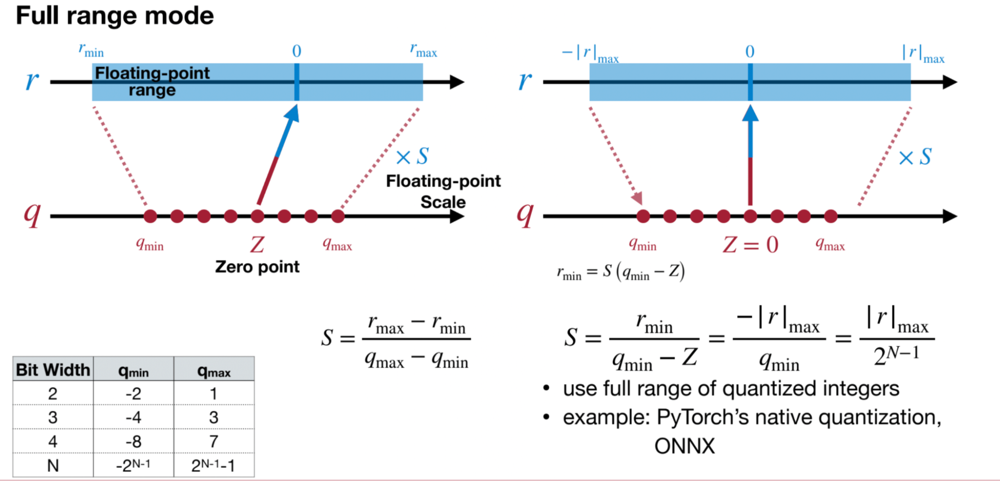

Linear quantization is a technique used to reduce the precision of numerical values, typically in the context of deep learning model parameters or activations. The process involves mapping high-precision floating-point numbers to a smaller set of discrete values while attempting to preserve the overall behavior and performance of the model.

Here's how linear quantization generally works:

* Initialization: Similar to other quantization methods, linear quantization starts with high-precision floating-point numbers representing model parameters or activations. These values are typically stored using 32-bit floating-point representation, which consumes considerable memory and computational resources.
* Range Determination: In linear quantization, the first step is to determine the range of values present in the data to be quantized. This involves finding the minimum and maximum values across all parameters or activations.
* Quantization Levels: After determining the range, the next step is to divide this range into a predefined number of equally spaced intervals, known as quantization levels or bins. These bins represent the discrete values that will replace the original floating-point numbers.
* Mapping: Each floating-point value is then mapped to the nearest quantization level based on its proximity. This mapping can be performed using simple linear interpolation or rounding techniques.
* Encoding: Once the mapping is done, the quantized values are typically encoded using a smaller number of bits. For example, instead of using 32 bits for floating-point representation, the quantized values might be encoded using 8 bits, 4 bits, or even fewer bits.
* Decoding: During inference, the quantized values are decoded back to their original floating-point representation before being used in computations.

Linear quantization offers several advantages:

* Memory Reduction: By reducing the precision of numerical values and encoding them with fewer bits, linear quantization significantly reduces the memory requirements for storing model parameters and activations.
* Speedup in Inference: The reduced memory footprint can lead to faster inference times due to reduced memory bandwidth requirements and potentially more efficient cache usage.
* Straightforward Implementation: Linear quantization is relatively straightforward to implement and understand compared to more complex quantization techniques.

However, linear quantization may lead to a loss of model accuracy, especially if not applied carefully. The choice of the number of quantization levels and the range determination method are critical factors in minimizing this loss. Additionally, careful consideration should be given to the impact of quantization on the overall behavior and performance of the model, especially in tasks where precision is crucial.

### Binary and Ternary Quantization

Binary and ternary quantization are specialized techniques used to further compress neural network models by reducing the precision of weights or activations to just two or three discrete levels, respectively.

Binary Quantization: In binary quantization, each weight or activation is represented using just two discrete levels: typically -1 and +1 or 0 and 1. This extreme reduction in precision drastically reduces the memory footprint and computational complexity of the model, making it highly efficient for deployment on low-power devices. Binary quantization is achieved by thresholding the floating-point values of weights or activations to their nearest binary representation. Although binary quantization can lead to significant model compression, it often comes with a noticeable degradation in accuracy compared to higher precision models.

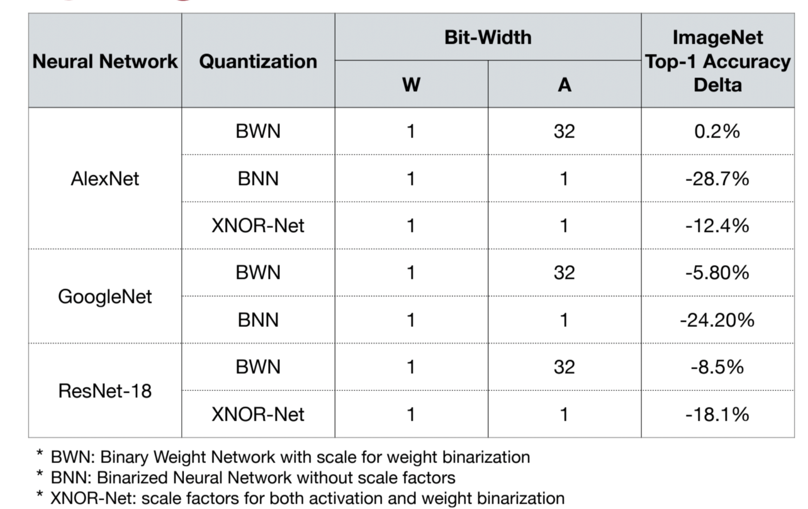

Ternary Quantization: Ternary quantization extends the idea of binary quantization by allowing weights or activations to take on three discrete levels, typically -1, 0, and +1. By introducing a neutral zero level, ternary quantization offers a compromise between model compression and accuracy preservation compared to binary quantization. Ternary quantization is achieved through techniques such as thresholding or clustering, where weights or activations are assigned to the nearest of the three discrete levels. While ternary quantization is not as aggressive in compression as binary quantization, it often achieves a better balance between model size reduction and accuracy retention.

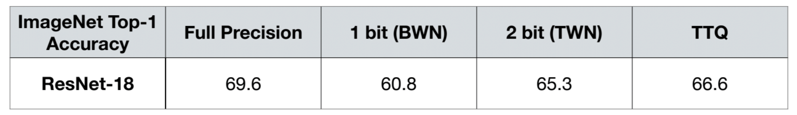

Both binary and ternary quantization techniques are particularly valuable for deploying neural network models on devices with stringent memory and computational constraints, such as mobile phones, IoT devices, or edge computing devices. However, achieving optimal performance with these techniques requires careful calibration, fine-tuning, and possibly architectural adjustments to mitigate any loss in accuracy introduced by the drastic reduction in precision.

### Automatic Mixed-precision Quantization

Automatic mixed-precision quantization optimizes neural network models by dynamically adjusting precision levels for parameters or layers. It balances computational efficiency and accuracy by using higher precision where needed and lower precision elsewhere. Techniques include dynamic scaling, layer-wise adjustment, and adaptive schemes. This approach is vital for deploying models on diverse hardware efficiently.

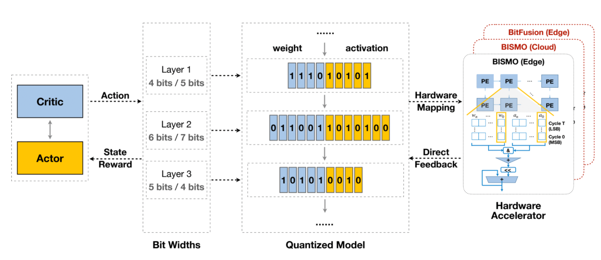

## Quantization for LLMs

### LLM.int8()

[Paper: LLM.int8(): 8-bit Matrix Multiplication for Transformers at Scale](https://arxiv.org/pdf/2208.07339.pdf)

[Huggingface implementation](https://huggingface.co/blog/hf-bitsandbytes-integration)

This paper presents LLM.int8(), a method for performing 8-bit matrix multiplication for transformer language models of up to 175 billion parameters without any performance degradation compared to the full 16-bit precision models. The key contributions are:

* Vector-wise quantization that uses separate quantization normalization constants for each inner product in the matrix multiplication to improve quantization precision up to 2.7B parameters.
* Analysis of emergent large magnitude "outlier" features in transformer layers that start appearing around 6.7B parameters and disrupt quantization precision.
* Mixed-precision decomposition that performs 16-bit matrix multiplication for the outlier feature dimensions (0.1% of values) and 8-bit for the rest, allowing full precision on large models.
* Showing LLM.int8() enables inference on models like OPT-175B and BLOOM on a single consumer GPU server while reducing memory footprint by half compared to 16-bit precision.

The paper provides insights into the characteristics of outlier features across transformer scales and their impact on attention and predictive performance. LLM.int8() makes very large language models more accessible by eliminating the performance degradation from naive 8-bit quantization methods.

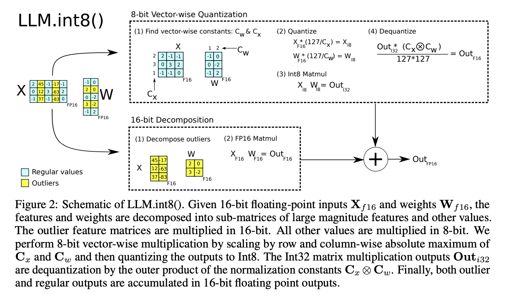

Currently, the implementation of LLM.int8() primarily resides in the bitsandbytes library, which has been integrated into the transformers library and natively supports it. Meanwhile, another quantization scheme, QLoRA, proposed by the author of LLM.int8(), is also implemented based on bitsandbytes.

### GPTQ

[Paper: GPTQ: ACCURATE POST-TRAINING QUANTIZATION FOR GENERATIVE PR E-TRAINED TRANSFORMERS](https://arxiv.org/pdf/2210.17323.pdf)

This paper introduces GPTQ, a new method for quantizing large language models like GPT and OPT to low bitwidths (e.g. 3 or 4 bits per weight) with minimal accuracy degradation. The key contributions are:

GPTQ is a one-shot post-training quantization method that can quantize models with hundreds of billions of parameters in just a few hours on a single GPU, while preserving accuracy. Previous methods either sacrificed accuracy at high compression rates or did not scale to such large models. It is based on approximate second-order information and quantizes weights in a specific order while updating the remaining weights to compensate for error. Several optimizations are proposed to make this computationally tractable for giant models.

GPTQ can quantize models like OPT-175B and BLOOM-176B down to 3-4 bits per weight with negligible increase in perplexity on language modeling tasks, outperforming simple rounding methods.

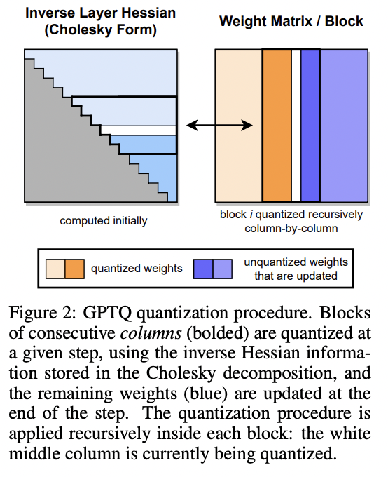

Here's a summary of the three key steps in the GPTQ algorithm:

Step 1: Arbitrary Order Insight

* The authors find that quantizing weights in an arbitrary fixed order (instead of the greedy optimal order used in previous methods) works almost as well, especially for large over-parameterized layers.
* This allows them to quantize all rows of a weight matrix in the same order, reducing the complexity from O(d_row * d_col^3) to O(max{d_row * d_col^2, d_col^3}).

Step 2: Lazy Batch-Updates

* Directly applying the updates has a low compute-to-memory-access ratio, leading to underutilization of GPU resources.
* To mitigate this, updates are "lazily batched" by quantizing B=128 columns at a time and only updating the corresponding BxB block of the inverse Hessian matrix.
* Global updates to the full weight matrix are performed once the block is quantized, improving GPU utilization.

Step 3: Cholesky Reformulation

* Repeated updates to the inverse Hessian can lead to numerical issues, especially for giant models.
* Instead of directly updating the inverse, the Cholesky decomposition of the inverse Hessian is precomputed, which is more numerically stable.
* The required information is extracted from the Cholesky factors in a robust manner during quantization.

Readings:

[https://towardsdatascience.com/4-bit-quantization-with-gptq-36b0f4f02c34](https://towardsdatascience.com/4-bit-quantization-with-gptq-36b0f4f02c34)

### SmoothQuant (W8A8)

[Paper: SmoothQuant: Accurate and Efficient Post-Training Quantization for Large Language Models](https://arxiv.org/pdf/2211.10438.pdf)

SmoothQuant is a post-training quantization (PTQ) method that ensures both accuracy and efficient inference, capable of achieving 8-bit weight and 8-bit activation (W8A8) quantization. Since weights are easy to quantize while activations pose a greater challenge, The key idea is to "smooth" the activation outliers by migrating the quantization difficulty from activations to weights through a mathematically equivalent transformation. This makes both weights and activations easy to quantize with low-precision integers.

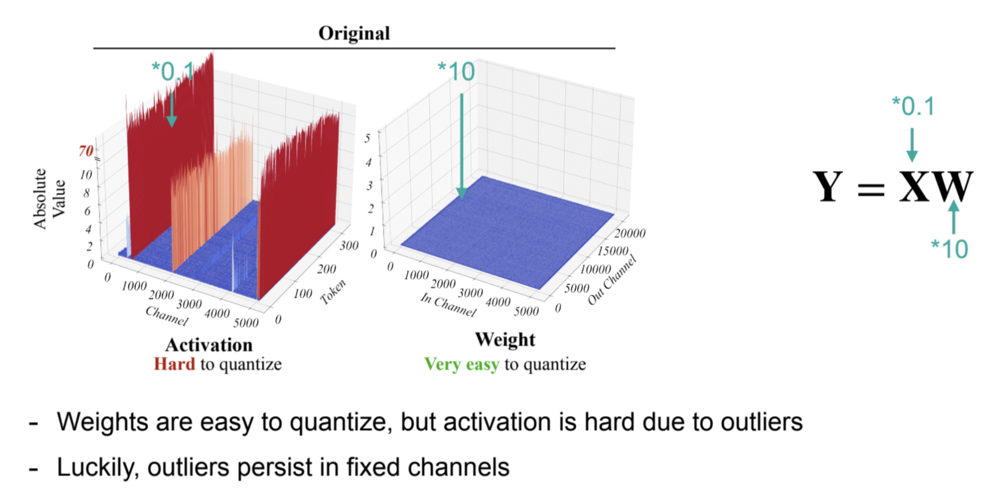

### AWQ

[Paper: AWQ: Activation-aware Weight Quantization for LLM Compression and Acceleration](https://arxiv.org/pdf/2306.00978.pdf)

LLM decoding is highly memory-bounded; W8A8 is not enough

* W8A8 quantization is good for batch serving (e.g., batch size 128)
* But single-query LLM inference (e.g., local) is still highly memory-bounded
* We need low-bit weight-only quantization (e.g., W4A16) for this setting

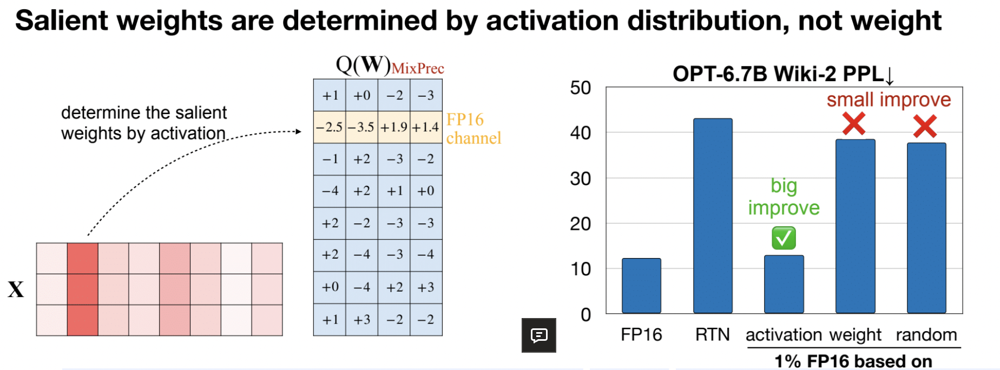

We find that weights are not equally important, keeping only 1% of salient weight channels in FP16 can greatly improve perplexity. How to find the weights? We should look for activation distribution, but not weight.

Multiplying the salient channels with S>1 reduces its quantization error like smoothQuant. Also no mixed precision weights and can be easier to train.

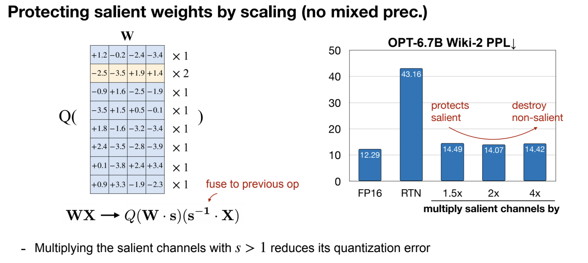

### The Era of 1-bit LLMs: All Large Language Models are in 1.58 Bits

[Paper: The Era of 1-bit LLMs: All Large Language Models are in 1.58 Bits.](https://arxiv.org/pdf/2402.17764.pdf)

[Ma, S., Wang, H., Ma, L., Wang, L., Wang, W., Huang, S., Dong, L., Wang, R., Xue, J., & Wei, F. (2024). The Era of 1-bit LLMs: All Large Language Models are in 1.58 Bits. ArXiv. /abs/2402.17764]

* Based on another paper: BitNet: Scaling 1-bit Transformers for Large Language Models 
* Matches the full-precision (i.e., FP16 or BF16) Transformer LLM with the same model size and training tokens in terms of both perplexity and end task performance
* While being significantly more cost-effective in terms of latency, memory, throughput, and energy consumption.

### GGUF
GGML, a C library created by Georgi Gerganov, focuses on machine learning (ML). Alongside fundamental ML elements like tensors, it introduces a distinct binary format, GGUF, for distributing LLMs (Large Language Models). GGUF aims for extensibility, ensuring new features won't disrupt compatibility with existing models. Notably, it consolidates metadata into one file, addressing past challenges and ensuring future adaptability. GGML models encompass those using GGUF or prior formats. GGML collaborates with llama.cpp, another of Gerganov's creations, for efficient Llama model inference. Originally designed for CPU execution, llama.cpp now enables GPU offloading for certain layers, notably enhancing inference speed for larger LLMs that exceed GPU memory capacity.

Readings:

[https://mlabonne.github.io/blog/posts/Quantize_Llama_2_models_using_ggml.html](https://mlabonne.github.io/blog/posts/Quantize_Llama_2_models_using_ggml.html)

## Toolkit and Code Examples

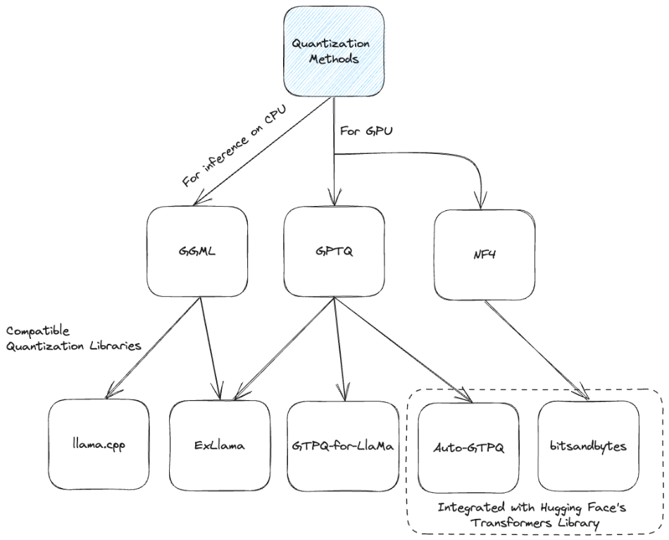

Some useful quantization tools: TGI, bitsandbytes, vLLM, tensorRT-LLM, AutoGPTQ, AutoAWQ

Readings:

[https://www.maartengrootendorst.com/blog/quantization/](https://www.maartengrootendorst.com/blog/quantization/)

## Reference

[https://hanlab.mit.edu/courses/2023-fall-65940](https://hanlab.mit.edu/courses/2023-fall-65940): lecture 5,6 and 13

[https://lilianweng.github.io/posts/2023-01-10-inference-optimization/](https://lilianweng.github.io/posts/2023-01-10-inference-optimization/)

[https://pytorch.org/blog/introduction-to-quantization-on-pytorch/](https://pytorch.org/blog/introduction-to-quantization-on-pytorch/)

[https://pytorch.org/docs/stable/quantization.html#best-practices](https://pytorch.org/docs/stable/quantization.html#best-practices)
